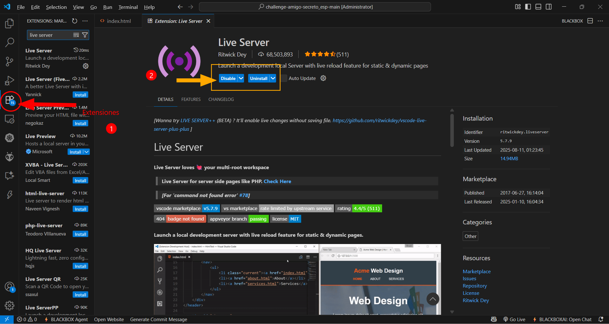

# challenge-amigo_secreto
Este repositorio contiene el reto de amigo secreto solicitado dentro del curso "Lógica de programación" otorgado por Alura Latam + Oracle.

| Nombre                  | Presentación           | Expectativas acerca del programa                                                                 |
|-------------------------|------------------------|-----------------------------------------------------------------------------------------------|
| **Hans Ortiz Valverde** | Estudiante de 9no semestre de Ingeniería Biomédica y participante del programa Oracle Next Education    | Aprender la lógica de programación que envuelve estos sistemas y encaminar mi progreso hacia lo que deseo especializarme, esto es en data science. |

## Paso a paso del uso del programa:
### 1. Descargar el programa Vscode en su última versión acorde a su sistema operativo:
Ingresar al link (https://code.visualstudio.com/download) 
### 2. Instalar el programa Vscode:
Seguir paso a paso el proceso de instalación del sistema
### 3. Descargar los archivos del challenge:
Esta listados como "assets", "app.js", "index.html", "style.css". Una vez descargados crear una carpeta llamada "challenge-amigo-secreto" o similar e incluir todos los archivos en dicha carpeta.
### 4. Abrir el programa Vscode:
Ejecutar como administrador al momento de su apertura.
### 5. Abrir la carpeta donde están los archivos:
Seguir los pasos como se muestra en la imagen:

### 6. Ir a extensiones e instalar la extensión de Vscode llamado Live Server:
En caso se requiera modificar y ver los cambios en tiempo real, se debe seguir lo que se muestra en la imagen:

En mi caso ya instalé dicha extensión pero debería aparecer "install"
### 7. Observar la extensión .html haciendo click a "Go live":
En la imagen se muestra cómo:

### 8. Challenge amigo secreto:
En la siguiente imagen se muestra los pasos a seguir para participar en el challenge, para ello se debe escribir nombres, darle click al botón correspondiente y así sucesivamente:

### 9. Salida Final Challenge amigo secreto:
Finalmente, se observa lo requerido del challenge al mostrarse el amigo secreto luego de darle click al botón "Sortear amigo"

